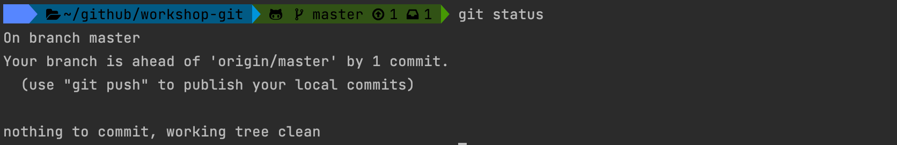
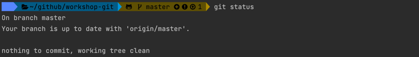
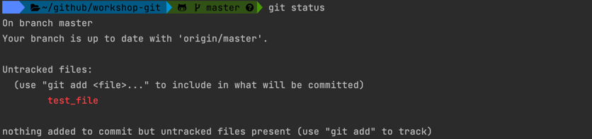
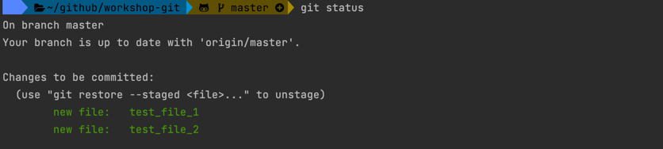

# workshop-git

## Commit

Create a new file in a project folder for example with `touch` command

```shell
touch test
```

Run `git status` 

```shell
touch test
```


Stage created untracked file to git with `git add` command:

```shell
git add test
```

Check operation with `git status`


Save changes in repository with `git commit` command:

```shell
git commit
```

Default text edit will be open, you need to add a commit message and save the file to perform commit:


Use `git status` to check the operation result:



Push commit to the remote repository

```shell
git push
```



Add 2 new files to the project folder

```shell
touch test_file_1
touch test_file_2
```

Created files are not added to git, check it with `git status`

```shell
git status                                                                                                                                     
```



Add both files to git, this time we will add all files 

```shell
git add .
```



> We can use `git add --all` or `git add -A`

```
git commit -m "Added test files"
```

Both files committed 


Push files to remote repository

```shell
git push
```

### Commit without staging

Create files test files

```shell
touch file_no_stage_1
touch file_no_stage_2
touch file_no_stage_3
```

Try to run git commit without adding files to staging

```shell
git commit -m "Stage files"
```


Files was not committed

We can add all files and commit at once

```shell
git commit -a -m "Added no stage file"
```

Check that files was committed


### TO_DO

```shell
git commit --amend -m "new message"
```