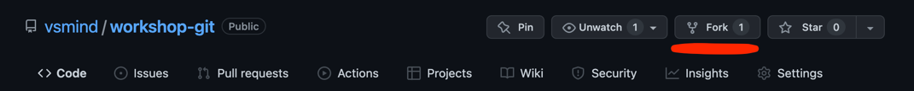
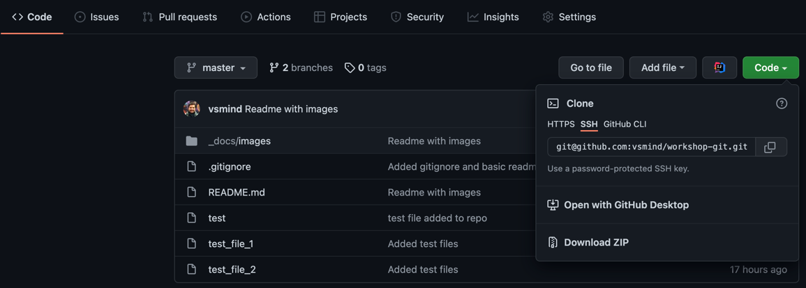

# Workshop setup

## Fork branch to your profile



Press `fork` button, project will be forked to your workspace

## Clone project to local filesystem

Clone a project from GitHub with help of `git clone` command:



- Press `Code` button
- Choose the protocol for cloning operation
- Press `copy` button to copy clone URL
- Open terminal and run `git clone` command in  a folder where you want to clone project

```shell
git clone __SSH__PATH__ 
```
