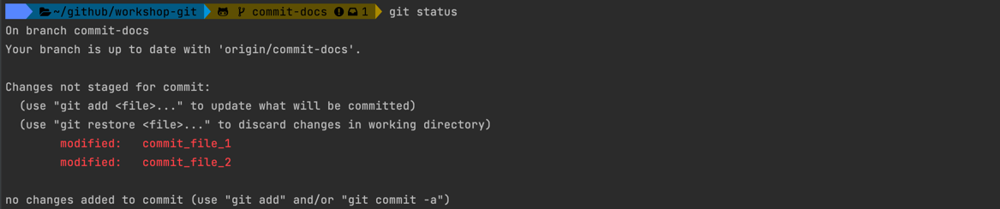

# Git commit

## Setup

- Checkout remote branch `01-commit-practice`

```shell
git checkout -b 01-commit-practice origin/01-commit-practice
```

> project branch changed to 01-commit-practice

## Commit

- Create a new file in a project folder for example with `touch` command

```shell
touch test
```

- Run `git status` to check the state of the repository 

```shell
git status
```


- Stage created untracked file with `git add` command:

```shell
git add test
```

- Check operation with `git status`


- Save changes in repository with `git commit` command:

```shell
git commit
```

> Default text edit will be open, you need to add a commit message and save the file to perform commit:


- Use `git status` to check the operation result:


- Push commit to the remote repository with `git push` command:

```shell
git push
```


- Add 2 new files to the project folder

```shell
touch test_file_1
touch test_file_2
```

> Created files are not added to git, check it with `git status` command:

```shell
git status                                                                                                                                     
```


- Add both files to git, this time we will add all files

```shell
git add .
```


> We can use `git add --all` or `git add -A`

- we can commit files with the message by `git commit` command

```
git commit -m "Added test files"
```

> Both files committed


- Push files to remote repository with `git push` command

```shell
git push
```

### Commit with staging

- Make some changed in `commit_file_1` and `commit_file_2` files (Add some text for example)

Try to run git commit without adding files to staging

```shell
git commit -m "Stage files"
```

> Files was not committed, check the `git status`

```shell
git status
```


- We can add all files to the stage and then commit at once with `git commit`:

```shell
git commit -a -m "Added no stage file"
```

> Check that files was committed

### Rephrase last commit

- Add another change to `commit_file_1`
- Commit file with error message

```shell
git commit -am "Stage commit_file_xxxxxx"
```

- Check the last commit with `git log` command:

```shell
git log -1
```



- We can change the commit message of last commit:

```shell
git commit --amend -m "New corrected commit message"
```

- Check the last commit:


## Next step

[<<< git merge](../01_branching/README.md)
[git merge >>>](../03_merge/README.md)
