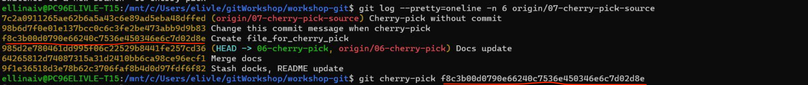

# Cherry-pick

- Checkout remote branch `06-cherry-pick`

```shell
git checkout -b 06-cherry-pick origin/06-cherry-pick
```

- check git log on target branch

```shell
git log --pretty=oneline -n 6 origin/07-cherry-pick-source
```

- get commit from another branch to our with help of `git cherry-pick`
- copy commit SHA for "Create file_for_cherry_pick" commit and use it in `git cherry-pick` command:

```shell
git cherry-pick f8c3b00d0790e66240c7536e450346e6c7d02d8e
```



- check the current log and see that you have cherry-pick commit on top of log

```shell
git log --pretty=oneline -n 5
```

- copy commit SHA for "Change this commit message when cherry-pick" commit `98b6d7f0e01e137bcc0c6c3fe2be473abb9d9b83`,
- use `git cherry-pick -edit` command to get commit but change commit message:

```shell
git cherry-pick --edit 98b6d7f0e01e137bcc0c6c3fe2be473abb9d9b83 
```

> Default editor will be open where you can change the commit message

- check the current log and see that you have cherry-pick commit with the new message

```shell
git log --pretty=oneline -n 5
```

- copy commit SHA for "Cherry-pick without commit" commit `7c2a0911265ae62b6a5a43c6e89ad5eba48dffed`
- use `git cherry-pick --no-commit` command to move content of the target commit into the working directory:

```shell
git cherry-pick --no-commit 7c2a0911265ae62b6a5a43c6e89ad5eba48dffed
```

- check the current log and see that cherry-pick have not created a new commit in your branch

```shell
git log --pretty=oneline -n 2
```

- Use git status, you will se a new file created by cherry-pick

```shell
git status
```

- Reset changes with `git reset --hard`

```shell
git reset --hard
```

## Navigation

[<<< git reset/revert](../04_reset_revert/README.md) |
[git rebase >>>](../06_rebase/README.md)


