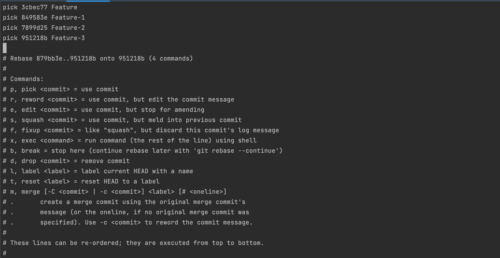
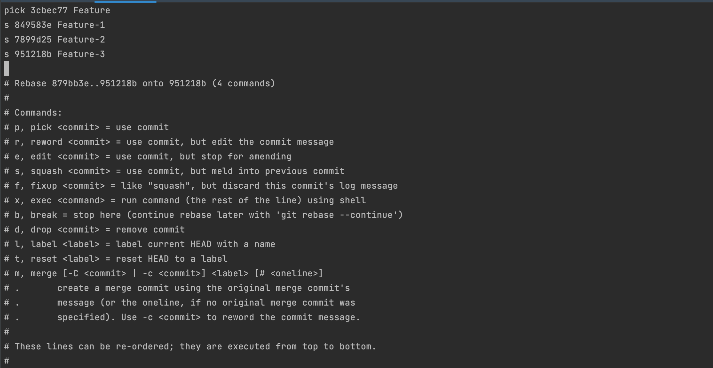
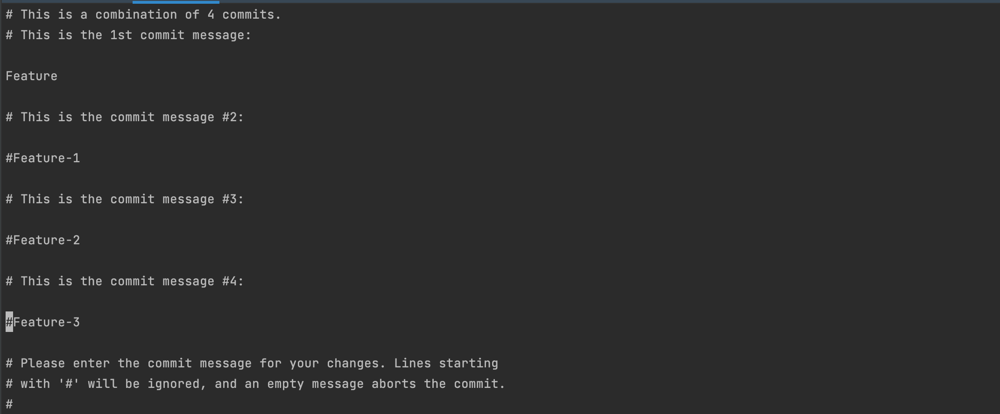

# Rebase

## Merge without rebase

- Checkout remote branch `08-main-merge-no-rebase`

```shell
git checkout -b 08-main-merge-no-rebase origin/08-main-merge-no-rebase
```

- Merge feature branch `09-main-merge-no-rebase-feature-1` to `08-main-merge-no-rebase`

```shell
git merge 09-main-merge-no-rebase-feature-1
```

> This will open editor to create merge commit

- Merge feature branch `10-main-merge-no-rebase-feature-2` to `08-main-merge-no-rebase`

```shell
git merge 10-main-merge-no-rebase-feature-2
```

> This will open editor to create merge commit

- Check log for our branch

```shell
git log --all --decorate --oneline --graph -n 10
```

=> Spaghetti log

## Rebase

We will work with branch 11-main-rebase as it's our main branch. 
2 developers worked with two feature branches in parallel.
We will merge their code to main branch with `git rebase`

- Checkout remote branch `11-main-rebase`

```shell
git checkout -b 11-main-rebase origin/11-main-rebase
```

- Checkout feature branch 1 `12-rebase-feature-1`

```shell
git checkout -b 12-rebase-feature-1 origin/12-rebase-feature-1
```

- This branch has 2 new commits. Run `git rebase` command:

```shell
git rebase 11-main-rebase
```

- Checkout `11-main-rebase` branch

```shell
git checkout 11-main-rebase
```

- Merge feature branch `12-rebase-feature-1`

```shell
git merge 12-rebase-feature-1
```

- Checkout feature branch 2 `13-rebase-feature-2`

```shell
git checkout -b 13-rebase-feature-2 origin/13-rebase-feature-2
```

- This branch has 3 new commits. Run `git rebase` command:

```shell
git rebase 11-main-rebase
```

- Checkout `11-main-rebase` branch:

```shell
git checkout 11-main-rebase
```

- Merge feature 2 branch:

```shell
git merge 13-rebase-feature-2
```

- Check log for our branch

```shell
git log --all --decorate --oneline --graph -n 10
```

> Git log is linear

## Interactive rebase with squash

We will work with branch `14-main-squash` as it's our main branch.
2 developers worked with two feature branches in parallel.
We will merge their code to main branch with interactive rebase.

- Checkout remote branch `14-main-squash`:

```shell
git checkout -b 14-main-squash origin/14-main-squash
```

- Checkout feature branch 1:

```shell
git checkout -b 15-squash-feature-1 origin/15-squash-feature-1
```

- This branch has 2 new commits. Run `git rebase -i` command:

```shell
git rebase -i 14-main-squash
```



> This will open interactive prompt where you should change the operation type to `squash` or `s`



> Then you will need to write/choose commit message



- Checkout `14-main-squash` branch:

```shell
git checkout 14-main-squash
```

- Merge feature branch `15-squash-feature-1`:

```shell
git merge 15-squash-feature-1
```

- Checkout feature branch 2 `16-squash-feature-2`:

```shell
git checkout -b 16-squash-feature-2 origin/16-squash-feature-2
```

- This branch has 3 new commits. Run `git rebase -i` command:

```shell
git rebase -i 14-main-squash
```

> This will open interactive prompt where you should change the operation type to `squash` or `s`
> Then you will need to write/choose commit message

- Checkout `14-main-squash` branch

```shell
git checkout 14-main-squash
```

- Merge feature 2 branch `16-squash-feature-2`:

```shell
git merge 16-squash-feature-2
```

- Check log for our branch

```shell
git log --all --decorate --oneline --graph -n 10
```

> git log is linear and only one commit with updated message shown foreach merge

## Navigation

[<<< git cherry-pick](../05_cherry_pick/README.md) |
[git stash >>>](../07_stash/README.md)
